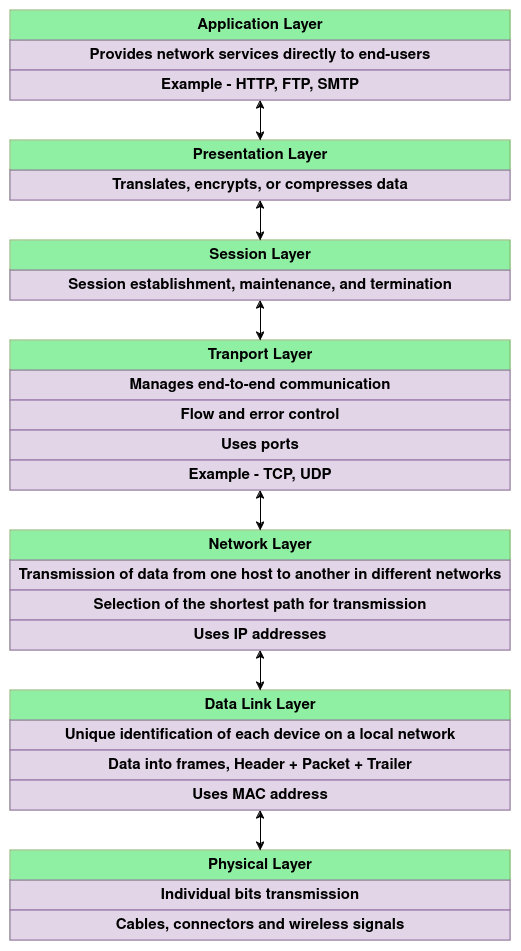
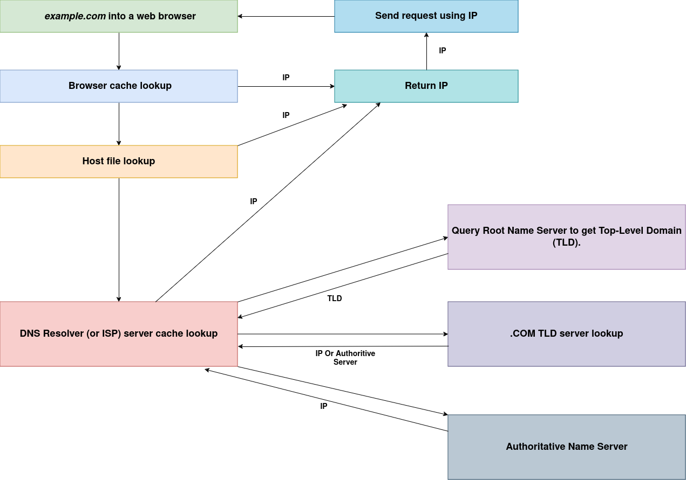

# system-design


# System Design

System design is the process of defining the architecture, components, modules, interfaces, and data for a system satisfying specified requirements. It's  like creating a blueprint of the system, considering factors like scalability, maintainability, and performance.


# Scalability

Scalability is altering the size of a system, either compressing or expanding the system to meet the expected needs.

- ## Horizontal Scaling 

  - Horizontal scaling is adding additional devices/servers to infrastructure in order to enhance capacity and efficiently manage rising traffic needs. 

- ## Vertical Scaling 

  - Vertical scaling is based on the idea of adding more power(CPU, RAM) to existing systems, basically adding more resources.


# Capacity Planning & Estimation

Capacity planning and estimation is the process of predicting the resources and infrastructure needed to support the expected workload on a system. 


## 1. Throughput (Request Per Second)

#### Example 1

Let's consider - **Temperature sensors** for a monitoring system. The system needs to measure temperature changes across a county using about **10 million sensors**. These sensors report changes **every 5 seconds**. Assuming each request from a sensor to server lasts **200 ms**, the average would be **2 million requests per second**.

```
# requests in 1 second = 1000ms/200ms = 5
Requests per second =  10 million / 5 = 2 million
```

#### Example 2

Sometimes, throughput isn’t evident in the requirements. Let's look at - **Social Media News Feed**:

The system allows users to post text, images, and videos on their profile timeline, which is organised chronologically. Users can follow others and see relevant posts from those they follow on their timeline.

If the most relevant posts appear in the timeline on the home page, all daily active users (500M) likely interact with it. Assume each user interacts with it a certain number of times per day (e.g., **10 times**), it means **5 billion page views per day, or roughly 60k requests per second.**

```
500M users @ 10x pageviews/user = 5B pageviews/day
5B pageviews / 86400 seconds (1 day = 24 * 60 * 60) = ~57.8k requests per second.
Round up to 60k requests per second.
```

Profile visits would likely be less frequent than homepage visits. If we assume that **each user visits two profile pages per day,** that results in **an average requests per second of about 12k.**

```
Simplest way to calculate: 20% of 60k (previous example) = 12k request per second

Or, to expand:

500M users @ 2x pageviews/user = 1B profile pageviews/day
1B pageviews / 86400 seconds (1 day = 24 * 60 * 60) = ~11.5k request per second
Round up to 12k
```

For posts, let’s assume that on average, **only 10% of the daily active users post once per day.** This would mean **an average requests per second of approximately 6k.**

```
Simplest way to calculate: 10% of 60k (previous example) = 6k request per second

Or, to expand:

500M users * 10% = 50M new posts/day
50M new posts / 86400 seconds (1 day = 24 * 60 * 60) = ~5.7k request per second
Round up to 6k
```


## 2. Peak Time Throughput (Request Per Second)

We often have to think about Peak Times. Certain parts of the day see more traffic than usual.

**10% per hour rule** - If 10% of that traffic happened during 1 hour, (or 30% of it during a 3 hour window), how much traffic per second is that?

```
500M users @ 10x page views / user = 5B pageviews/day
10% of pageviews = 500M pageviews per hour
Average Peak request per second = 500M / 3600 (60 minutes in seconds) = 138k
```


## 3. Server Requirement

In **Example 1 - Temperature sensors**, the system has an average response time of 200ms and needs to handle 2M requests per second, and each application server can manage 32 workers handling 160 requests per second, we’d need around 12.5k server instances.

```
2M request per second, 200ms avg response time per request
Each instance has 32 workers
Each worker can handle 5 queries per second (200ms*5)
Each instance can handle then 160 request per second
2M (average request per second) / 160 = 12.5k instances
```


## 4. Request Size

For a system like **Example 1 - Temperature Sensors**, the data sent may be relatively small. Assuming data is sent in JSON  format, we can estimate the size of each field. The temperature is  reported as a float (4 bytes), the sensor ID is a UUID (16 bytes), and  we have three additional 4-byte fields. Accounting for the JSON format,  the total request body size is less than 100 bytes. Including HTTP  headers (typically between 200 to 400 bytes), we can conservatively  estimate each request size to be around 0.5KB. This is quite small.  

For a system like **Example 2 - Social Media News Feed**, we’re dealing with diverse content types - text, images, and videos.  While text posts might only be a few KB, images files could be several  hundred KB, and video files could be several MB. In these scenarios, an  average request size needs to consider the distribution and size of various content types.

```
For 10 posts:
- Every post has 1KB (text) = 10KB
- Three have an image = 300KB * 3 = 900KB
- One has a video = 1000KB

~191KB, round up to 200KB
```


## 5. Bandwidth & data in transit

#### Client to server (ingress)

In **Example 1 - Temperature sensors**, the data sent by the sensors to the application is known as **ingress**:  incoming data to the application's network. Suppose each sensor request  is 0.5KB and the average requests per seconnd is 400k, our average ingress bandwidth is  approximately 200MB/second. 

#### Server to client (egress)

When considering a system like **Example 2 - Social Networking News Feed**, posting content would equate to ingress traffic. Based on our previous  estimates, suppose each post is 1KB and we’ve got an average of 6k request per second, our ingress bandwidth is about 6MB/second.

The  egress, or the data transmitted from the server to client, can be complex. Suppose our system paginates every 20 posts, and the server renders raw file versions each time. In this scenario, our average egress bandwidth would be very high at **~250GB/second**:

```
500M users @ 10x pageviews/user = 5B pageviews/day
Average post request size: 200KB
Assuming every time timelines are rendered the server sends everything to the client.

20 posts * 200 KB = 4MB
5B pageviews * 4MB = 20PB
20PB / 86400 (1 day = 24 * 60 * 60) = ~231GB/s

Round up to ~250GB/s
```


# Open Systems Interconnection (OSI) model



# IP

An IP address is a unique address that identifies a device on the internet or a local network. IP stands for *"Internet Protocol"*.


## Versions

### IPv4

IPv4 which uses a 32-bit numeric dot-decimal notation.

*Example: `192.168.51.18`*

### IPv6

This new protocol uses 128-bit alphanumeric hexadecimal notation. That's more than enough to meet the growing demand for years to come. IPv4 was not enough with growing internet. 

*Example: `2001:0db8:85a3:0000:0000:8a2e:0370:7334`*


## Types

### Public

A public IP address is the one primary address associated with your whole network. Each of the connected devices in the network has the same IP address.

*Example: IP address provided to your router by the ISP.*

### Private

A private IP address is a unique IP number assigned to every device that connects to your internet network.

*Example: IP addresses generated by your home router for your devices.*

### Static

A static IP address does not change and is one that was manually created. These addresses are usually more expensive but are more reliable.

*Example: Used in reliable geo-location services, remote access, server hosting, etc.*

### Dynamic

A dynamic IP address is most common type and changes from time to time. They are cheaper to deploy and allow us to reuse IP addresses within a network as needed.

*Example: They are more commonly used for consumer equipment and personal use.*


# TCP vs UDP

| Feature             | TCP                                         | UDP                                             |
| ------------------- | ------------------------------------------- | ----------------------------------------------- |
| Connection          | Requires an established connection          | Connection less protocol                        |
| Guaranteed delivery | Can guarantee delivery of data              | Can not guarantee delivery of data              |
| Re-transmission     | Re-transmission of lost packets is possible | No re-transmission of lost packets              |
| Speed               | Slower than UDP                             | Faster than TCP+                                |
| Broadcasting        | Does not support broadcasting               | Supports broadcasting                           |
| Use cases           | HTTPS, HTTP, SMTP, FTP, etc                 | Video streaming, DNS, Voice over IP (VoIP), etc |


# Domain Name System (DNS)

Domain Name System (DNS)  is a  hierarchical and decentralised naming system used for translating  human-readable domain names to IP addresses. Example -  `google.com` whose IP could be something like `122.250.192.232`.

## How DNS works



